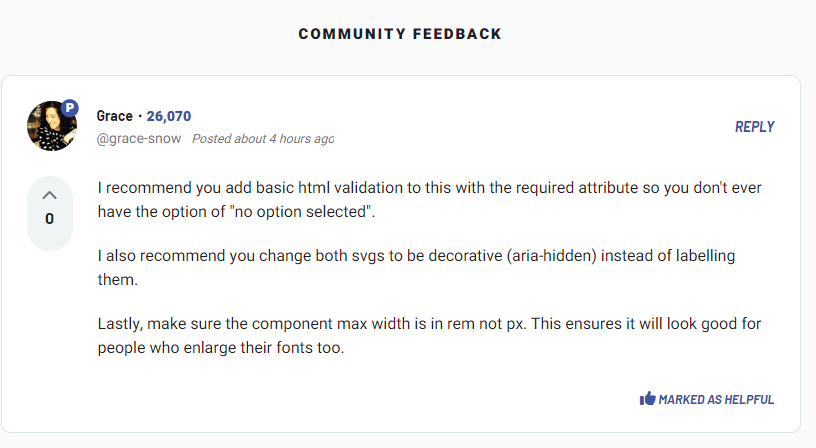

# Frontend Mentor - Interactive rating component solution

This is a solution to the [Interactive rating component challenge on Frontend Mentor](https://www.frontendmentor.io/challenges/interactive-rating-component-koxpeBUmI). Frontend Mentor challenges help you improve your coding skills by building realistic projects.

## Table of contents

- [Overview](#overview)
  - [The challenge](#the-challenge)
  - [Screenshot](#screenshot)
  - [Links](#links)
- [My process](#my-process)
  - [Built with](#built-with)
  - [What I learned](#what-i-learned)
  - [Coding Suggestions and Improvements](#coding-suggestions-and-improvements)

## Overview

### The challenge

Users should be able to:

- View the optimal layout for the app depending on their device's screen size
- See hover states for all interactive elements on the page
- Select and submit a number rating
- See the "Thank you" card state after submitting a rating

### Screenshot


### Links

- Solution URL: [code](https://github.com/phangtono/Interactive-rating-component)
- Live Site URL: [live-site](https://calm-babka-081fc0.netlify.app/)

## My process

### Built with

- Semantic HTML5 markup
- CSS custom properties
- Flexbox
- CSS Grid
- Mobile-first workflow
- Js

### What I learned

I use :checked and +label, so when the radio element is clicked, the following CSS runs.

```css
.rating__star > input:checked +label{
    background-color: var(--clr-neutral-medium-grey);
    color: var(--clr-neutral-white);
}
```

As soon as the submission moves to page, the system checks the incoming parameters. then update the html content. and this runs when the content is loading.

```js
document.addEventListener('DOMContentLoaded', function() {
    const urlParams = new URLSearchParams(window.location.search);
    const starRating = urlParams.get('star');

    const thankyouScore = document.querySelector('.thankyou__score');

    if (starRating !== null) {
        thankyouScore.textContent = `You selected ${starRating} out of 5`;
    } else {
        thankyouScore.textContent = 'No star rating selected';
    }
});
```
### Coding Suggestions and Improvements

After receiving advice from mentor @grace : 



I made improvements to my script :

a. I added attr : required to the input element

```html
  <div class="rating__star">
    <input type="radio" id="star-1" name="star" value="1" required>
    <label class="star" for="star-1">1</label>

    <input type="radio" id="star-2" name="star" value="2" required>
    <label for="star-2">2</label>

    <input type="radio" id="star-3" name="star" value="3" required>
    <label for="star-3">3</label>

    <input type="radio" id="star-4" name="star" value="4" required>
    <label for="star-4">4</label>

    <input type="radio" id="star-5" name="star" value="5" required>
    <label for="star-5">5</label>    
  </div>
```
I added aria-hidden="true" to the <svg> 
```html
    <div class="rating__image">
      <svg role="img" width="17" height="16" xmlns="http://www.w3.org/2000/svg" aria-hidden="true">
        <path d="m9.067.43 1.99 4.031c.112.228.33.386.58.422l4.45.647a.772.772 0 0 1 .427 1.316l-3.22 3.138a.773.773 0 0 0-.222.683l.76 4.431a.772.772 0 0 1-1.12.813l-3.98-2.092a.773.773 0 0 0-.718 0l-3.98 2.092a.772.772 0 0 1-1.119-.813l.76-4.431a.77.77 0 0 0-.222-.683L.233 6.846A.772.772 0 0 1 .661 5.53l4.449-.647a.772.772 0 0 0 .58-.422L7.68.43a.774.774 0 0 1 1.387 0Z" fill="#FC7614"/>
      </svg>
    </div>
```
Update max-width from 320px to 20rem
```css
.rating,
.thankyou{
    --circle-width: 2.5em;
    --bolder:1.25em;
    background-color: var(--clr-neutral-dark-blue);
    border-radius: var(--bolder);
    padding: var(--bolder);
    display: flex;
    flex-direction: column;
    gap: var(--bolder);
    max-width: 20rem;
}
```