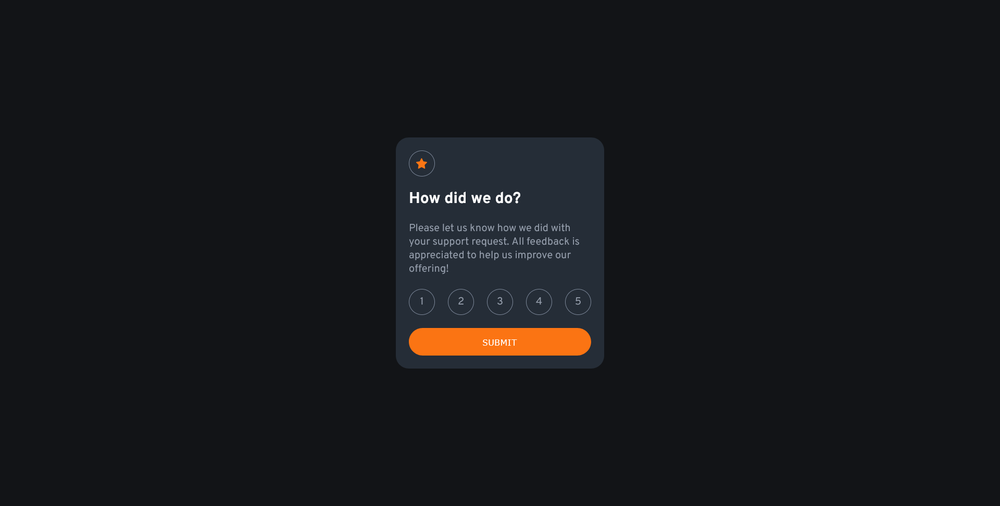

# Frontend Mentor - Interactive rating component solution

This is a solution to the [Interactive rating component challenge on Frontend Mentor](https://www.frontendmentor.io/challenges/interactive-rating-component-koxpeBUmI). Frontend Mentor challenges help you improve your coding skills by building realistic projects.

## Table of contents

- [Overview](#overview)
  - [The challenge](#the-challenge)
  - [Screenshot](#screenshot)
  - [Links](#links)
- [My process](#my-process)
  - [Built with](#built-with)
  - [What I learned](#what-i-learned)

## Overview

### The challenge

Users should be able to:

- View the optimal layout for the app depending on their device's screen size
- See hover states for all interactive elements on the page
- Select and submit a number rating
- See the "Thank you" card state after submitting a rating

### Screenshot



### Links

- Solution URL: [code](https://github.com/phangtono/Interactive-rating-component)
- Live Site URL: [live-site](https://your-live-site-url.com)

## My process

### Built with

- Semantic HTML5 markup
- CSS custom properties
- Flexbox
- CSS Grid
- Mobile-first workflow
- Js

### What I learned

I use :checked and +label, so when the radio element is clicked, the following CSS runs.

```css
.rating__star > input:checked +label{
    background-color: var(--clr-neutral-medium-grey);
    color: var(--clr-neutral-white);
}
```

As soon as the submission moves to page, the system checks the incoming parameters. then update the html content. and this runs when the content is loading.

```js
document.addEventListener('DOMContentLoaded', function() {
    const urlParams = new URLSearchParams(window.location.search);
    const starRating = urlParams.get('star');

    const thankyouScore = document.querySelector('.thankyou__score');

    if (starRating !== null) {
        thankyouScore.textContent = `You selected ${starRating} out of 5`;
    } else {
        thankyouScore.textContent = 'No star rating selected';
    }
});
```
